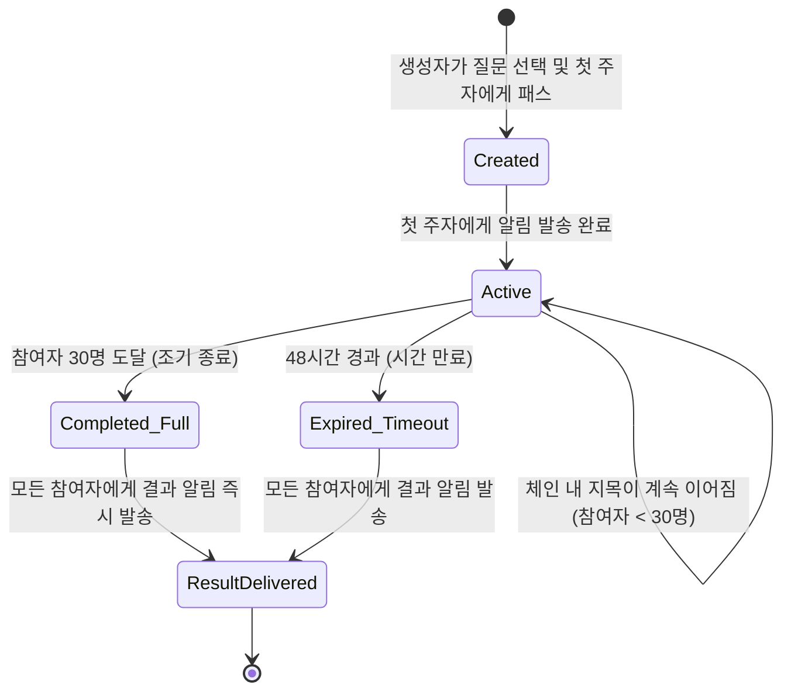
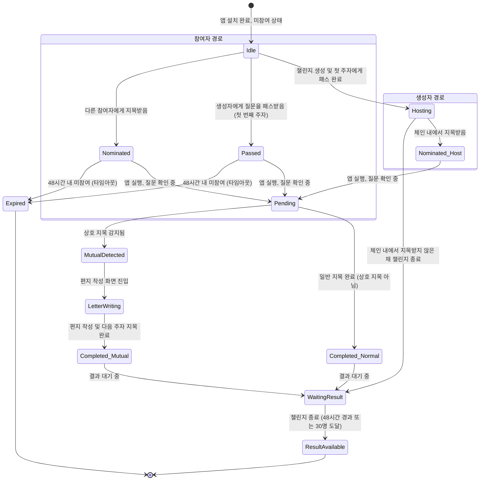
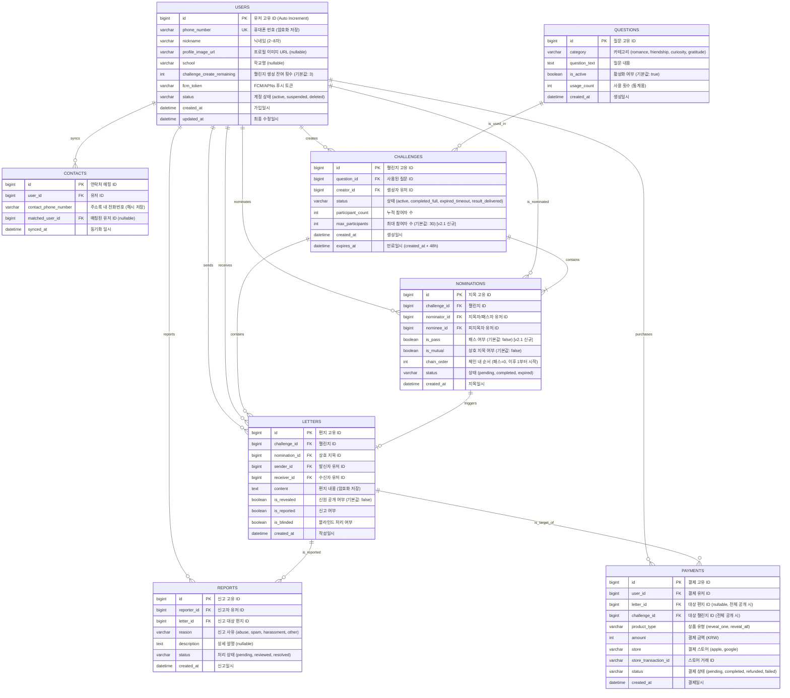

# Heart to Hearts 상세 기능기획서

**문서 버전:** 2.1

**작성일:** 2026년 2월 24일

**작성자:** Manus AI

**v2.1 주요 변경사항:** 생성자 역할 분리(패스 메커니즘 도입), 챌린지당 최대 참여 인원 30명 제한

---

## 목차

1. [서비스 개요](#1-서비스-개요)
2. [용어 정의](#2-용어-정의-glossary)
3. [사용자 플로우](#3-사용자-플로우-user-flow)
4. [챌린지 상태 다이어그램](#4-챌린지-상태-다이어그램)
5. [화면별 상세 명세](#5-화면별-상세-명세-uiux)
6. [질문 세트 설계](#6-질문-세트-설계)
7. [데이터 모델](#7-데이터-모델-erd)
8. [API 명세](#8-api-명세)
9. [엣지 케이스 및 예외 처리](#9-엣지-케이스-및-예외-처리)
10. [바이럴 루프 설계](#10-바이럴-루프-viral-loop-설계)
11. [푸시 알림 전략](#11-푸시-알림-전략-및-문구)
12. [수익 모델](#12-수익-모델-및-정책)
13. [운영 정책](#13-운영-정책)
14. [성과 지표](#14-성과-지표-kpi)
15. [향후 로드맵](#15-향후-로드맵)
16. [참고 문헌](#16-참고-문헌-references)

---

## 1. 서비스 개요

### 1.1. 서비스 명

**Heart to Hearts**

### 1.2. 서비스 정의

Heart to Hearts는 사용자가 친구 관계 속에서 긍정적인 감정을 익명으로 전달하고 발견하는 **꼬리물기형 소셜 챌린지 애플리케이션**입니다. 유튜브에서 학생들이 "누가 제일 예뻐?", "네가 관심 있는 사람은 누구야?" 라고 물으며 꼬리에 꼬리를 무는 인터뷰 콘텐츠에서 영감을 받았습니다. 이 서비스는 누군가를 지목하면 그 질문이 지목된 사람에게 이어지는 연쇄적인 메커니즘을 통해 사용자의 궁금증과 설렘을 극대화하고, 상호 지목이 이루어졌을 때 익명의 편지를 주고받는 경험을 제공하여 관계의 특별한 순간을 만들어냅니다.

### 1.3. 핵심 가치

| 가치 | 설명 |
| :--- | :--- |
| **재미와 궁금증** | 내가 누구에게 지목받았을지, 누가 나에게 마음을 표현했을지 추측하는 과정에서 오는 순수한 재미와 설렘을 제공합니다. 48시간이라는 제한 시간은 긴장감과 몰입도를 높여줍니다. |
| **긍정적 관계 형성** | 익명성을 기반으로 평소 표현하기 어려웠던 긍정적인 감정을 전달하게 함으로써, 기존 관계를 더욱 돈독하게 만들고 새로운 관계의 가능성을 열어줍니다. |
| **자연스러운 바이럴** | 꼬리물기 방식의 챌린지 전파 구조 자체가 곧 바이럴 루프입니다. 한 명이 참여하면 반드시 다음 한 명을 초대해야 하므로, 별도의 마케팅 비용 없이도 사용자 기반이 확장됩니다. |

### 1.4. 타겟 유저

| 구분 | 상세 |
| :--- | :--- |
| **1차 타겟** | 중고등학생 (만 14~18세). 학교라는 밀접한 소셜 그래프 안에서 친구 관계에 대한 호기심이 가장 강하고, 새로운 소셜 트렌드에 가장 민감한 집단입니다. Nikita Bier의 분석에 따르면, 13세에서 18세 사이 사용자는 나이가 1살 증가할 때마다 앱 초대 횟수가 약 20%씩 감소하므로 [1], 가능한 한 어린 연령대를 핵심 타겟으로 설정하는 것이 바이럴 성장에 유리합니다. |
| **2차 타겟** | 대학생 (만 19~24세). 새로운 인간관계가 형성되는 대학 환경에서 관심 있는 사람을 익명으로 표현하고 싶은 욕구가 존재합니다. |
| **사용 환경** | iOS / Android 모바일 앱 전용. 모든 핵심 인터랙션은 푸시 알림을 통해 시작되므로 모바일 네이티브 경험이 필수적입니다. |

### 1.5. 핵심 메커니즘 요약

아래는 서비스의 핵심 작동 원리를 단계별로 정리한 것입니다. v2.1에서 **생성자(A)의 역할이 "지목자"에서 "호스트(질문을 던지는 사람)"로 변경**되었으며, 챌린지 종료 조건에 **"30명 도달 시 조기 종료"**가 추가되었습니다.

| 단계 | 행위자 | 행위 | 결과 |
| :--- | :--- | :--- | :--- |
| 1 | **A (생성자/호스트)** | 질문 세트에서 질문을 선택하고, 첫 번째 주자 B에게 질문을 **패스(Pass)**합니다. A는 질문에 대해 답하지 않습니다. | B에게 **"누군가 당신에게 질문을 던졌어요!"** 푸시 알림이 발송됩니다. |
| 2 | **B (첫 번째 참여자)** | 푸시 알림을 통해 앱에 진입하고, 질문에 대한 답으로 C를 **지목(Nominate)**합니다. B는 A가 질문을 던졌다는 사실을 알 수 없습니다. | C에게 **"누군가 당신을 지목했어요!"** 푸시 알림이 발송됩니다. |
| 3 | **C (참여자)** | 질문에 대한 답으로 누군가를 지목합니다. C는 B가 자신을 지목했다는 사실을 알 수 없습니다. | (분기 발생) |
| 4-A | C | C가 **D를 지목**한 경우 (일반 지목) | D에게 푸시 알림이 발송되고, 체인이 이어집니다. |
| 4-B | C | C가 **B를 지목**한 경우 (상호 지목 성립) | C에게 편지 작성 화면이 표시됩니다. |
| 5 | C | (상호 지목 시) B에게 보낼 익명 편지를 작성하고, 체인을 이어갈 다음 주자(E)를 지목합니다. | B에게 편지가 전달되고, E에게 푸시 알림이 발송됩니다. |
| 6 | 시스템 | 챌린지 시작 후 **48시간이 경과**하거나, **참여자가 30명에 도달**하면 챌린지가 종료됩니다. | 모든 참여자에게 결과 알림이 발송됩니다. |
| 7 | 모든 참여자 | 결과 보관함에서 나에 대해 작성된 편지의 **내용만** 확인합니다. 작성자는 익명입니다. | (분기 발생) |
| 8-A | 참여자 | 작성자 1명을 알고 싶은 경우, **1,052원**을 결제합니다. | 해당 편지 작성자의 신원이 공개됩니다. |
| 8-B | 참여자 | 모든 작성자를 알고 싶은 경우, **5,260원** (1,052원 x 5)을 결제합니다. | 모든 편지 작성자의 신원이 공개됩니다. |

> **v2.1 핵심 변경**: 생성자(A)는 질문을 선택하고 첫 주자에게 "패스"만 할 뿐, 자신의 마음을 표현하지 않습니다. 이를 통해 챌린지 생성의 심리적 허들을 낮추고, 생성자의 익명성을 보장합니다. 생성자도 체인 안에서 누군가에게 지목받으면 자연스럽게 참여자로 전환됩니다.

### 1.6. 생성자(호스트)와 참여자의 역할 비교

| 구분 | 생성자 (Host) | 참여자 (Participant) |
| :--- | :--- | :--- |
| **진입 방식** | 직접 챌린지를 생성 | 다른 사람의 지목/패스로 진입 |
| **질문 응답** | 응답하지 않음 (패스만 수행) | 질문에 답하며 다음 사람을 지목 |
| **마음 노출** | 없음 (익명성 보장) | 지목 행위를 통해 마음 표현 (상대방은 모름) |
| **상호 지목 가능** | 체인 내에서 지목받은 후에만 가능 | 가능 |
| **인당 제한** | 최대 3회 생성 가능 | 제한 없음 (지목받는 횟수 무제한) |

---

## 2. 용어 정의 (Glossary)

일관된 커뮤니케이션을 위해 서비스 내 핵심 용어를 다음과 같이 정의합니다. 이 문서 전체에서 아래 용어는 정의된 의미로만 사용됩니다.

| 용어 | 영문명 | 정의 |
| :--- | :--- | :--- |
| **챌린지** | Challenge | 사용자가 특정 질문을 선택하여 시작하는 48시간 한정 이벤트 단위입니다. 하나의 챌린지 안에는 하나의 챌린지 체인이 존재하며, **최대 30명**까지 참여할 수 있습니다. |
| **챌린지 체인** | Challenge Chain | 한 챌린지 내에서 B→C→D→... 로 이어지는 지목의 연결 고리 전체를 의미합니다. 생성자(A)의 패스는 체인에 포함되지 않으며, 첫 번째 참여자(B)의 지목부터 체인이 시작됩니다. |
| **챌린지 생성자 (호스트)** | Challenge Creator (Host) | 챌린지를 최초로 시작한 사용자입니다. 질문을 선택하고 첫 주자에게 **패스**하는 역할만 수행하며, 본인은 질문에 답하지 않습니다. 인당 최대 3회까지 생성할 수 있습니다. |
| **참여자** | Participant | 챌린지에 지목(또는 패스)되어 질문에 답변하는 모든 사용자를 의미합니다. 생성자도 체인 내에서 지목받으면 참여자로 전환됩니다. |
| **패스** | Pass | **생성자만 수행하는 행위**로, 첫 번째 주자에게 질문을 넘기는 것을 의미합니다. 패스는 생성자 자신의 마음을 표현하지 않으며, 일반적인 지목과 구분됩니다. |
| **지목** | Nomination | **참여자가 수행하는 행위**로, 주어진 질문에 대해 특정 친구 1명을 선택하는 것을 의미합니다. 지목은 곧 "이 질문에 대한 나의 답은 이 사람이다"라는 의미를 내포합니다. |
| **피지목자** | Nominee | 다른 참여자에 의해 지목된 사용자입니다. 피지목자는 자신을 누가 지목했는지 알 수 없습니다. |
| **상호 지목** | Mutual Nomination | A가 B를 지목하고, B 또한 A를 지목한 경우를 의미합니다. 이 경우 편지 작성 이벤트가 발생합니다. **패스는 상호 지목의 대상이 되지 않습니다.** |
| **편지** | Letter | 상호 지목이 성립되었을 때, 지목한 상대방에게 익명으로 보낼 수 있는 텍스트 메시지입니다. |
| **질문 세트** | Question Set | 챌린지 생성 시 사용자가 선택할 수 있는 질문들의 모음입니다. 서버에서 관리 및 주기적으로 업데이트됩니다. |
| **결과 보관함** | Result Box | 챌린지 종료 후, 나에 대해 작성된 편지들을 모아 볼 수 있는 공간입니다. |
| **신원 공개** | Identity Reveal | 유료 결제를 통해 익명 편지 작성자의 프로필(이름, 사진)을 확인하는 행위입니다. |

---

## 3. 사용자 플로우 (User Flow)

### 3.1. 신규 사용자: 가입 및 첫 챌린지 참여

이 플로우는 친구로부터 지목을 받아 앱을 처음 설치하는 가장 일반적인 신규 사용자 시나리오입니다.

| 단계 | 화면 ID | 행위 | 시스템 반응 |
| :--- | :--- | :--- | :--- |
| 1 | - | 사용자가 "누군가 당신을 지목했어요!" 또는 "누군가 당신에게 질문을 던졌어요!" 푸시 알림(또는 SMS 딥링크)을 탭합니다. | 앱스토어로 이동하거나 앱이 실행됩니다. |
| 2 | ON-01 | 앱이 실행되면 스플래시 화면이 1.5초간 표시됩니다. | 자동으로 다음 화면으로 전환됩니다. |
| 3 | ON-02 | 3~4컷의 온보딩 화면을 스와이프하며 서비스 핵심 가치를 확인합니다. | '시작하기' 버튼이 마지막 페이지에 표시됩니다. |
| 4 | ON-03 | '시작하기'를 탭하면 주소록 접근 권한 요청 팝업이 표시됩니다. | 허용 시 주소록 데이터를 서버로 동기화합니다. |
| 5 | ON-03 | 주소록 권한 처리 후 푸시 알림 권한 요청 팝업이 표시됩니다. | 허용 시 FCM/APNs 토큰을 서버에 등록합니다. |
| 6 | AU-01 | 휴대폰 번호를 입력하고 '인증번호 받기'를 탭합니다. | 서버에서 SMS로 6자리 인증번호를 발송합니다. |
| 7 | AU-02 | 수신한 6자리 인증번호를 입력합니다. | 서버에서 인증번호를 검증하고, 성공 시 계정을 생성하며 JWT 토큰을 발급합니다. |
| 8 | PR-01 | 이름(닉네임)과 프로필 사진을 설정하고 '완료'를 탭합니다. | 프로필 정보가 서버에 저장됩니다. |
| 9 | CH-02 | 자동으로 자신을 지목한 챌린지의 친구 선택 화면으로 이동합니다. 상단에 질문이 표시되고, 하단에 친구 목록이 나타납니다. | - |
| 10 | CH-02 | 친구 1명을 선택하고 '보내기'를 탭합니다. | 서버에 지목 데이터가 저장되고, 피지목자에게 푸시 알림이 발송됩니다. |
| 11 | HO-02 | 홈 화면으로 이동하며, 참여 중인 챌린지 카드가 표시됩니다. | - |

### 3.2. 기존 사용자: 챌린지 생성 (v2.1 변경)

이 플로우에서 생성자는 질문에 답하지 않고, 첫 번째 주자에게 질문을 **패스**합니다.

| 단계 | 화면 ID | 행위 | 시스템 반응 |
| :--- | :--- | :--- | :--- |
| 1 | HO-01/02 | 홈 화면에서 '새 챌린지 시작하기 (남은 횟수/3)' 버튼을 탭합니다. | 남은 횟수가 0이면 버튼이 비활성화되고, "이미 3번의 챌린지를 모두 사용했어요." 토스트 메시지가 표시됩니다. |
| 2 | CH-01 | 질문 선택 화면에서 카테고리별 질문 목록을 탐색하고, 원하는 질문을 탭합니다. | 선택된 질문이 하이라이트 되고, '다음' 버튼이 활성화됩니다. |
| 3 | CH-02-H | **"누구에게 이 질문을 넘길까요?"** 안내와 함께 친구 선택 화면이 표시됩니다. 친구 1명을 선택합니다. | CTA 버튼이 **'OOO님에게 질문 넘기기'**로 활성화됩니다. |
| 4 | CH-03 | 확인 팝업: **"이 질문을 OOO님에게 넘길까요? (남은 횟수: X/3)"** | '시작하기' 탭 시 챌린지가 생성되고, 첫 주자(B)에게 **"누군가 당신에게 질문을 던졌어요!"** 푸시 알림이 발송됩니다. 사용자의 챌린지 생성 가능 횟수가 1 차감됩니다. |
| 5 | HO-02 | 홈 화면으로 복귀하며, 방금 생성한 챌린지 카드가 목록 최상단에 추가됩니다. 카드에 **'내가 만든 챌린지'** 뱃지가 표시됩니다. | - |

### 3.3. 상호 지목 발생 시: 편지 작성 플로우

| 단계 | 화면 ID | 행위 | 시스템 반응 |
| :--- | :--- | :--- | :--- |
| 1 | CH-02 | B가 친구 선택 화면에서 C를 지목하고, 이후 C가 B를 지목합니다. (C는 B가 자신을 지목했다는 사실을 모릅니다.) | 서버에서 상호 지목을 감지합니다. |
| 2 | LT-00 | 상호 지목 축하 화면: "(B의 닉네임)님과 마음이 통했어요!" 라는 애니메이션과 함께 축하 메시지가 표시됩니다. | 3초간 표시 후 자동으로 편지 작성 화면으로 전환됩니다. |
| 3 | LT-01 | 편지 작성 화면: 상단에 안내 문구, 중앙에 텍스트 입력창(500자 제한), 하단에 글자 수 카운터와 '다음' 버튼이 표시됩니다. | 최소 10자 이상 입력해야 '다음' 버튼이 활성화됩니다. |
| 4 | CH-02 | 편지 작성 후 '다음'을 탭하면, 체인을 이어갈 다음 주자를 지목하는 친구 선택 화면으로 이동합니다. (B는 목록에서 제외됩니다.) | - |
| 5 | CH-02 | 다음 주자(E)를 선택하고 '보내기'를 탭합니다. | 편지가 서버에 저장되고, E에게 푸시 알림이 발송됩니다. B에게는 상호 지목 사실이 즉시 알려지지 않으며, 챌린지 종료 후 결과 확인 시점에 편지를 확인할 수 있습니다. |

### 3.4. 생성자가 체인 내에서 지목받는 플로우 (v2.1 신규)

| 단계 | 화면 ID | 행위 | 시스템 반응 |
| :--- | :--- | :--- | :--- |
| 1 | - | 생성자(A)가 만든 챌린지의 체인 내에서 참여자(D)가 A를 지목합니다. | A에게 "누군가 당신을 지목했어요!" 푸시 알림이 발송됩니다. |
| 2 | CH-02 | A가 알림을 탭하면, 일반 참여자와 동일한 친구 선택 화면으로 이동합니다. 상단에 질문이 표시됩니다. | A의 상태가 **호스트(Hosting)**에서 **참여자(Participating)**로 전환됩니다. |
| 3 | CH-02 | A는 다른 참여자와 동일하게 질문에 답하며 다음 주자(E)를 지목합니다. | 서버에서 상호 지목 여부를 판별합니다. (A가 D를 지목하면 상호 지목 성립) |

### 3.5. 결과 확인 및 결제 플로우

| 단계 | 화면 ID | 행위 | 시스템 반응 |
| :--- | :--- | :--- | :--- |
| 1 | - | 48시간 경과 또는 30명 도달 후, "결과가 도착했습니다!" 또는 "챌린지가 마감되었습니다!" 푸시 알림을 수신합니다. | - |
| 2 | RE-01 | 알림을 탭하면 결과 보관함으로 이동합니다. 나에 대해 작성된 익명 편지 목록이 표시됩니다. | 편지가 없는 경우 "이번 챌린지에서는 편지가 도착하지 않았어요. 다음 챌린지를 기대해주세요!" 메시지가 표시됩니다. |
| 3 | RE-02 | 편지를 탭하면 상세 화면으로 이동합니다. 편지 전문이 표시되며, 작성자는 '익명'으로 표시됩니다. | - |
| 4 | RE-02 | '작성자 확인하기' 버튼을 탭합니다. | 결제 옵션 바텀시트가 올라옵니다. |
| 5 | PAY-01 | 결제 옵션 바텀시트: "이 편지를 쓴 사람이 궁금하다면?" 이라는 문구와 함께 두 가지 옵션이 표시됩니다. (1) 이 사람만 확인 - 1,052원 (2) 모든 작성자 확인 - 5,260원 | 사용자가 옵션을 선택합니다. |
| 6 | PAY-01 | 옵션 선택 후 '결제하기'를 탭합니다. | OS 인앱 결제 모듈(Apple/Google)이 호출됩니다. |
| 7 | PAY-01 | 인앱 결제를 완료합니다. (Face ID/지문/비밀번호 인증) | 서버에서 영수증을 검증하고, 성공 시 해당 편지의 작성자 신원을 공개합니다. |
| 8 | RE-02 | 결제 완료 후 편지 상세 화면에서 '익명' 표시가 작성자의 프로필 사진과 이름으로 변경됩니다. | - |

---

## 4. 챌린지 상태 다이어그램

### 4.1. 챌린지 전체 상태

하나의 챌린지는 다음과 같은 생명주기를 가집니다. v2.1에서 **"30명 도달 시 조기 종료(Completed_Full)"** 상태가 추가되었습니다.

### 4.2. 사용자 개인 상태 (v2.1 변경)

챌린지 내 각 사용자는 **생성자(호스트)**와 **참여자** 두 가지 경로로 진입하며, 생성자도 체인 내에서 지목받으면 참여자로 전환됩니다.

---

## 5. 화면별 상세 명세 (UI/UX)

### 5.1. 온보딩 (Onboarding)

#### ON-01. 스플래시 화면

| 항목 | 상세 |
| :--- | :--- |
| **목적** | 브랜드 인지 및 앱 초기 로딩 |
| **구성 요소** | 화면 중앙에 Heart to Hearts 로고 및 앱 아이콘. 배경은 브랜드 메인 컬러(그라디언트 가능). |
| **동작** | 1.5초간 노출 후 자동으로 ON-02 또는 HO-01(기존 사용자)로 전환됩니다. |
| **전환 조건** | 로컬 스토리지에 JWT 토큰이 존재하면 → HO-01/02로 이동. 없으면 → ON-02로 이동. |

#### ON-02. 가치 제안 (온보딩 슬라이드)

| 항목 | 상세 |
| :--- | :--- |
| **목적** | 신규 사용자에게 서비스의 핵심 가치를 3초 이내에 전달 |
| **구성 요소** | 3페이지 구성의 수평 스와이프 뷰. 각 페이지는 일러스트(상단 60%)와 텍스트(하단 40%)로 구성됩니다. |
| **페이지 1** | 일러스트: 두 사람이 서로를 가리키는 모습. 텍스트: **"너의 마음은 누구에게?"** / "친구를 지목하면, 그 질문이 이어져요." |
| **페이지 2** | 일러스트: 편지봉투에서 하트가 나오는 모습. 텍스트: **"마음이 통하면, 익명의 편지가 도착해요"** / "서로를 지목하면 특별한 일이 일어나요." |
| **페이지 3** | 일러스트: 시계와 자물쇠. 텍스트: **"48시간 후, 모든 것이 공개됩니다"** / "누가 나를 지목했을까? 두근거리는 48시간이 시작돼요." |
| **하단 요소** | 페이지 인디케이터(점 3개), '건너뛰기' 텍스트 버튼(좌하단), '다음'/'시작하기' 버튼(우하단). 마지막 페이지에서만 '시작하기'로 변경됩니다. |

#### ON-03. 권한 요청

| 항목 | 상세 |
| :--- | :--- |
| **목적** | 서비스 운영에 필수적인 OS 권한 획득 |
| **주소록 접근** | 커스텀 사전 안내 화면: "친구들을 챌린지에 초대하고, 누가 나를 지목했는지 확인하려면 주소록 접근 권한이 필요해요." + '허용하기' 버튼. 버튼 탭 시 OS 기본 권한 요청 팝업을 호출합니다. |
| **푸시 알림** | 커스텀 사전 안내 화면: "누군가 당신을 지목하면 바로 알려드릴게요! 실시간으로 챌린지 현황을 놓치지 마세요." + '알림 받기' 버튼. 버튼 탭 시 OS 기본 권한 요청 팝업을 호출합니다. |
| **거부 시 처리** | 주소록 거부: 앱 이용은 가능하나 친구 목록이 비어있으며, 챌린지 생성/참여 시 권한 재요청 안내가 표시됩니다. 푸시 알림 거부: 앱 이용은 가능하나, 지목 알림을 받지 못하므로 참여율이 현저히 낮아집니다. 설정 화면에서 알림 활성화를 유도하는 배너를 지속적으로 표시합니다. |

### 5.2. 가입 및 프로필 (Authentication & Profile)

#### AU-01. 휴대폰 번호 입력

| 항목 | 상세 |
| :--- | :--- |
| **구성 요소** | 상단 타이틀: "휴대폰 번호로 시작하기". 국가번호 선택 드롭다운(기본값: +82 대한민국). 휴대폰 번호 입력 필드(숫자 키패드 자동 활성화). '인증번호 받기' 버튼. |
| **입력 유효성** | 숫자만 입력 가능. 하이픈(-) 자동 포맷팅(010-XXXX-XXXX). 10~11자리 입력 시 버튼 활성화. |
| **에러 처리** | 잘못된 형식: "올바른 휴대폰 번호를 입력해주세요." 이미 가입된 번호: 에러 없이 인증번호 발송 후 AU-02로 이동. (기존 계정 로그인 처리) |

#### AU-02. 인증번호 입력

| 항목 | 상세 |
| :--- | :--- |
| **구성 요소** | 상단 안내: "OOO-OOOO-OOOO로 인증번호를 보냈어요." 6자리 개별 입력 필드(자동 포커스 이동). 유효시간 타이머(3:00부터 카운트다운). '인증번호가 오지 않나요? 재전송' 텍스트 버튼. |
| **동작** | 6자리 입력 완료 시 자동으로 서버에 검증 요청. 검증 성공 시 PR-01(신규) 또는 HO-01(기존)로 이동. |
| **에러 처리** | 인증번호 불일치: "인증번호가 일치하지 않아요. 다시 확인해주세요." + 입력 필드 초기화. 유효시간 만료: "인증번호가 만료되었어요. 재전송 버튼을 눌러주세요." 재전송 제한: 동일 번호로 60초 내 재전송 불가. "60초 후에 다시 시도해주세요." |

#### PR-01. 프로필 설정

| 항목 | 상세 |
| :--- | :--- |
| **구성 요소** | 상단 타이틀: "프로필을 설정해주세요". 원형 프로필 이미지 영역(기본 아바타 표시, 탭 시 앨범/카메라 선택 액션시트). 이름(닉네임) 입력 필드. 학교 정보 입력 필드(선택, "학교를 입력하면 같은 학교 친구를 더 쉽게 찾을 수 있어요!" 안내 문구). '완료' 버튼. |
| **입력 규칙** | 이름: 2~8자, 한글/영문/숫자 허용, 특수문자 및 공백 불가. 프로필 사진: 선택 사항. 미등록 시 기본 아바타 사용. 학교: 선택 사항. 자동완성 검색 지원(학교 DB 연동). |
| **동작** | 이름 입력 시 '완료' 버튼 활성화. '완료' 탭 시 프로필 저장 후 HO-01 또는 CH-02(지목 대기 중인 챌린지가 있는 경우)로 이동. |

### 5.3. 홈 화면 (Home)

#### HO-01. 홈 (챌린지 없음 - Empty State)

| 항목 | 상세 |
| :--- | :--- |
| **구성 요소** | 상단 앱바: 좌측 로고, 우측 설정(톱니바퀴) 아이콘. 화면 중앙: 일러스트 + "아직 진행 중인 챌린지가 없어요" 안내 문구. CTA 버튼: '새 챌린지 시작하기 (3/3)' (남은 생성 횟수 표시). 하단 탭바: [홈] [보관함] [마이페이지]. |
| **동작** | CTA 버튼 탭 → CH-01(질문 선택)으로 이동. |

#### HO-02. 홈 (챌린지 진행 중) (v2.1 변경)

| 항목 | 상세 |
| :--- | :--- |
| **구성 요소** | 상단 앱바: 좌측 로고, 우측 설정(톱니바퀴) 아이콘. 챌린지 카드 리스트(세로 스크롤). '새 챌린지 시작하기' 플로팅 버튼(남은 횟수 표시, 0이면 비활성화). 하단 탭바: [홈] [보관함] [마이페이지]. |
| **챌린지 카드 구성** | 질문 내용(1줄, 말줄임 처리). 남은 시간: "47:12:05 남음" (실시간 카운트다운). **참여자 수: "12 / 30명 참여 중"** (v2.1: 최대 인원 대비 현재 인원 표시). 내 상태 뱃지: '내 차례!' (지목 미완료 시, 강조 색상), '참여 완료' (지목 완료 시, 회색), 또는 **'내가 만든 챌린지'** (v2.1: 생성자인 경우, 별도 색상). |
| **동작** | '내 차례!' 뱃지가 있는 카드 탭 → CH-02(친구 지목)로 이동. '참여 완료' 또는 '내가 만든 챌린지' 카드 탭 → 챌린지 상세 정보(참여자 수, 남은 시간 등) 확인 화면. |

### 5.4. 챌린지 생성 및 참여

#### CH-01. 질문 선택

| 항목 | 상세 |
| :--- | :--- |
| **구성 요소** | 상단 타이틀: "어떤 질문으로 시작할까요?". 카테고리 필터 탭(수평 스크롤): [전체] [#설렘] [#우정] [#궁금] [#감사]. 질문 카드 그리드(2열) 또는 리스트. 각 카드에 질문 텍스트와 카테고리 태그 표시. |
| **동작** | 카테고리 탭 선택 시 해당 카테고리 질문만 필터링. 질문 카드 탭 시 선택 상태(테두리 하이라이트) + 하단 '다음' 버튼 활성화. |

#### CH-02. 친구 선택 (v2.1 변경: 생성자/참여자 분기)

이 화면은 **생성자(질문 패스 시)**와 **참여자(답변 지목 시)**가 보는 UI가 다릅니다.

| 구분 | 생성자 모드 (CH-02-H) | 참여자 모드 (CH-02-P) |
| :--- | :--- | :--- |
| **상단 안내 문구** | **"누구에게 이 질문을 넘길까요?"** | **"[질문 내용]"** (e.g., "솔직히 요즘 제일 신경 쓰이는 사람은?") |
| **보조 안내 문구** | "선택한 친구에게 이 질문이 전달됩니다. 당신의 선택은 비밀이에요." | "당신의 마음을 담아 한 명을 선택해주세요." |
| **검색 바** | "이름으로 검색" | "이름으로 검색" |
| **친구 목록** | 주소록 기반 전체 친구 목록 | 주소록 기반 친구 목록 (이미 참여 중인 사람은 '이미 참여 중' 표시) |
| **CTA 버튼** | **"OOO님에게 질문 넘기기"** | **"OOO님에게 보내기"** |
| **목록 정렬** | 가나다순. Heart to Hearts 가입 유저 우선 표시. | 가나다순. Heart to Hearts 가입 유저 우선 표시. |

**공통 제한 사항:** 자기 자신은 목록에서 제외됩니다. 미가입 친구를 선택할 경우, 해당 친구에게 SMS로 앱 설치 링크가 발송됩니다.

#### CH-03. 챌린지 시작/지목 확인 팝업 (v2.1 변경: 생성자/참여자 분기)

| 구분 | 생성자 모드 | 참여자 모드 |
| :--- | :--- | :--- |
| **타이틀** | "질문을 넘길까요?" | "이 사람에게 보낼까요?" |
| **내용** | "질문: [선택한 질문 텍스트]" + "대상: [선택한 친구 이름]" + **"남은 생성 횟수: X/3"** | "질문: [질문 텍스트]" + "대상: [선택한 친구 이름]" |
| **확인 버튼** | '시작하기' | '보내기' |
| **취소 버튼** | '취소' (팝업 닫힘, CH-02 유지) | '취소' (팝업 닫힘, CH-02 유지) |

### 5.5. 편지 작성

#### LT-00. 상호 지목 축하 화면

| 항목 | 상세 |
| :--- | :--- |
| **구성 요소** | 전체 화면 오버레이. 중앙에 하트 애니메이션(Lottie). 텍스트: "(상대방 이름)님과 마음이 통했어요!". |
| **동작** | 3초간 표시 후 자동으로 LT-01로 전환. 화면 탭 시 즉시 LT-01로 전환. |

#### LT-01. 편지 작성

| 항목 | 상세 |
| :--- | :--- |
| **구성 요소** | 상단 안내: "(상대방 이름)님에게 진심을 담아 편지를 보내보세요." 텍스트 입력 영역: placeholder "이 사람이 좋은 이유, 전하고 싶은 말을 자유롭게 적어주세요." 글자 수 카운터: "0 / 500" (우하단). 하단 CTA: '다음' 버튼. |
| **입력 규칙** | 최소 10자, 최대 500자. 금칙어 입력 시 실시간 경고: "부적절한 표현이 포함되어 있어요." + 해당 단어 하이라이트. 10자 미만 시 '다음' 버튼 비활성화. |
| **동작** | '다음' 탭 → CH-02-P(다음 주자 지목)로 이동. 이때 상호 지목 상대는 친구 목록에서 제외됩니다. |

### 5.6. 결과 보관함

#### RE-01. 결과 보관함 (편지 목록)

| 항목 | 상세 |
| :--- | :--- |
| **구성 요소** | 상단 타이틀: "나의 보관함". 편지 카드 리스트. 각 카드: 익명 아이콘(물음표 아바타), 챌린지 질문(1줄), 편지 내용 미리보기(2줄, 말줄임), 수신 일시. |
| **빈 상태** | "아직 도착한 편지가 없어요. 챌린지에 참여하면 특별한 편지를 받을 수 있어요!" |
| **동작** | 카드 탭 → RE-02(편지 상세)로 이동. |

#### RE-02. 편지 상세

| 항목 | 상세 |
| :--- | :--- |
| **구성 요소 (미공개 상태)** | 상단: 익명 아이콘 + "익명의 누군가" 텍스트. 중앙: 편지 전문. 하단 CTA: '이 사람이 궁금하다면?' 버튼. 우상단: '신고하기' 아이콘 버튼. |
| **구성 요소 (공개 상태)** | 상단: 작성자 프로필 사진 + 이름. 중앙: 편지 전문. 하단 CTA: 버튼 제거 또는 '감사 인사 보내기'(향후 기능). |
| **동작** | '이 사람이 궁금하다면?' 탭 → PAY-01(결제 옵션 바텀시트) 표시. |

### 5.7. 결제

#### PAY-01. 결제 옵션 바텀시트

| 항목 | 상세 |
| :--- | :--- |
| **구성 요소** | 바텀시트 형태. 타이틀: "이 편지를 쓴 사람이 궁금하다면?". 옵션 1: '이 사람만 확인하기' - **1,052원**. 옵션 2: '모든 작성자 확인하기' - **5,260원** + "가장 인기!" 뱃지. 하단: '결제하기' 버튼 + 결제 안내 문구("결제는 Apple/Google 계정을 통해 진행됩니다."). |
| **동작** | 옵션 선택 → '결제하기' 탭 → OS 인앱 결제 모듈 호출 → 결제 성공 시 서버 영수증 검증 → 신원 공개 → RE-02 화면 갱신. 결제 실패/취소 시 바텀시트 유지 + 에러 토스트. |

### 5.8. 마이페이지

#### MY-01. 마이페이지

| 항목 | 상세 |
| :--- | :--- |
| **구성 요소** | 프로필 영역: 프로필 사진, 이름, 학교(입력한 경우). '프로필 수정' 버튼. 통계 영역: "참여한 챌린지 N개", "받은 편지 N통", "보낸 편지 N통". 메뉴 리스트: [알림 설정], [공지사항], [자주 묻는 질문], [이용약관], [개인정보처리방침], [문의하기], [로그아웃], [회원탈퇴]. 앱 버전 정보(하단). |

---

## 6. 질문 세트 설계

챌린지의 재미와 다양성을 위해 서버에서 관리되는 질문 세트를 카테고리별로 설계합니다. 질문은 운영팀에 의해 주기적으로 추가/수정/비활성화될 수 있습니다.

### 6.1. 카테고리 및 질문 예시

| 카테고리 | 질문 예시 | 톤앤매너 |
| :--- | :--- | :--- |
| **#설렘** | "솔직히 요즘 제일 신경 쓰이는 사람은?" | 로맨틱, 두근거림 |
| **#설렘** | "만약 단둘이 여행을 간다면 같이 가고 싶은 사람은?" | 로맨틱, 두근거림 |
| **#설렘** | "눈이 마주치면 괜히 심장이 뛰는 사람은?" | 로맨틱, 두근거림 |
| **#우정** | "힘들 때 가장 먼저 연락하고 싶은 친구는?" | 따뜻함, 신뢰 |
| **#우정** | "평생 옆에 있어줬으면 하는 친구는?" | 따뜻함, 신뢰 |
| **#우정** | "같이 있으면 시간이 제일 빨리 가는 친구는?" | 따뜻함, 신뢰 |
| **#궁금** | "첫인상과 지금 인상이 가장 다른 사람은?" | 호기심, 재미 |
| **#궁금** | "10년 뒤에 가장 성공해 있을 것 같은 사람은?" | 호기심, 재미 |
| **#궁금** | "비밀이 가장 많을 것 같은 사람은?" | 호기심, 재미 |
| **#감사** | "올해 가장 고마웠던 사람은?" | 감동, 진심 |
| **#감사** | "나를 가장 잘 이해해주는 사람은?" | 감동, 진심 |

### 6.2. 질문 세트 운영 규칙

질문 세트는 서비스의 신선도를 유지하는 핵심 콘텐츠입니다. 운영팀은 매주 최소 2~3개의 새로운 질문을 추가하고, 참여율이 낮은 질문은 비활성화하는 방식으로 관리합니다. 시즌별(발렌타인데이, 크리스마스, 시험 기간 등) 한정 질문을 추가하여 시의성을 확보할 수 있습니다. 사용자가 질문을 직접 제안할 수 있는 '질문 제안하기' 기능을 마이페이지에 추가하는 것도 고려할 수 있습니다.

---

## 7. 데이터 모델 (ERD) (v2.1 변경)

### 7.1. 테이블 구조

v2.1에서 `CHALLENGES` 테이블에 **`max_participants`** 컬럼이 추가되었고, `NOMINATIONS` 테이블에 **`is_pass`** 컬럼이 추가되었습니다.

> **v2.1 변경점 요약**: `CHALLENGES.max_participants` 컬럼은 챌린지별 최대 참여 인원을 관리하며, 기본값은 30입니다. `NOMINATIONS.is_pass` 컬럼은 생성자의 패스 행위(`true`)와 참여자의 지목 행위(`false`)를 구분합니다. `NOMINATIONS.chain_order`에서 패스는 0, 첫 번째 참여자의 지목은 1부터 시작합니다.

### 7.2. 주요 인덱스

| 테이블 | 인덱스 | 용도 |
| :--- | :--- | :--- |
| USERS | `idx_phone_number` (UNIQUE) | 로그인 시 번호 조회 |
| CONTACTS | `idx_user_id`, `idx_contact_phone_number` | 친구 매칭 조회 |
| CHALLENGES | `idx_status_expires_at` | 만료 대상 챌린지 배치 조회 |
| CHALLENGES | `idx_creator_id` | 생성자별 챌린지 조회 (v2.1: 호스트 상태 관리) |
| NOMINATIONS | `idx_challenge_nominee` (challenge_id, nominee_id) | 특정 챌린지 내 지목 여부 확인 |
| NOMINATIONS | `idx_challenge_nominator` (challenge_id, nominator_id) | 상호 지목 판별 |
| NOMINATIONS | `idx_challenge_is_pass` (challenge_id, is_pass) | 패스/지목 구분 조회 (v2.1 신규) |
| LETTERS | `idx_receiver_id` | 결과 보관함 조회 |

---

## 8. API 명세 (v2.1 변경)

### 8.1. 인증 (Authentication)

| Method | Endpoint | Request Body | Response | 설명 |
| :--- | :--- | :--- | :--- | :--- |
| POST | `/v1/auth/request-code` | `{ "phone_number": "+821012345678" }` | `{ "success": true, "expires_in": 180 }` | 인증번호 SMS 발송 요청. 60초 내 재요청 불가. |
| POST | `/v1/auth/verify-code` | `{ "phone_number": "+821012345678", "code": "123456" }` | `{ "access_token": "jwt...", "refresh_token": "jwt...", "is_new_user": true }` | 인증번호 검증 및 토큰 발급. 신규 유저 여부 반환. |
| POST | `/v1/auth/refresh` | `{ "refresh_token": "jwt..." }` | `{ "access_token": "jwt..." }` | 액세스 토큰 갱신. |

### 8.2. 사용자 (Users)

| Method | Endpoint | Request Body | Response | 설명 |
| :--- | :--- | :--- | :--- | :--- |
| GET | `/v1/users/me` | - | `{ "id", "nickname", "profile_image_url", "school", "challenge_create_remaining", ... }` | 내 프로필 조회. |
| PUT | `/v1/users/me` | `{ "nickname": "홍길동", "profile_image_url": "https://...", "school": "OO고등학교" }` | `{ "success": true }` | 프로필 업데이트. |
| POST | `/v1/users/me/contacts` | `{ "contacts": [{ "name": "김철수", "phone_hash": "sha256..." }] }` | `{ "matched_count": 15 }` | 주소록 동기화. 전화번호는 클라이언트에서 SHA-256 해시 후 전송. |
| GET | `/v1/users/me/friends` | Query: `?search=김` | `{ "friends": [{ "id", "nickname", "profile_image_url", "is_app_user" }] }` | 친구 목록 조회 (검색 지원). |

### 8.3. 질문 (Questions)

| Method | Endpoint | Request Body | Response | 설명 |
| :--- | :--- | :--- | :--- | :--- |
| GET | `/v1/questions` | Query: `?category=romance` | `{ "questions": [{ "id", "category", "question_text" }] }` | 활성화된 질문 목록 조회. 카테고리 필터 지원. |

### 8.4. 챌린지 (Challenges) (v2.1 변경)

| Method | Endpoint | Request Body | Response | 설명 |
| :--- | :--- | :--- | :--- | :--- |
| POST | `/v1/challenges` | `{ "question_id": 1, "first_pass_user_id": 42 }` | `{ "challenge_id": 100, "expires_at": "2026-02-25T14:00:00Z" }` | **v2.1 변경**: 필드명이 `first_nominee_id`에서 **`first_pass_user_id`**로 변경. 생성자의 행위가 '지목'이 아닌 '패스'임을 명확히 합니다. 생성 잔여 횟수 1 차감. 잔여 0이면 403 에러. |
| GET | `/v1/challenges/active` | - | `{ "challenges": [{ "id", "question_text", "status", "my_role", "my_status", "participant_count", "max_participants", "expires_at" }] }` | **v2.1 변경**: 응답에 `max_participants`(최대 인원)와 `my_role`(`host` 또는 `participant`) 필드 추가. |
| GET | `/v1/challenges/{id}` | - | `{ "id", "question_text", "status", "participant_count", "max_participants", "chain": [...], "expires_at" }` | 특정 챌린지 상세 조회. |

### 8.5. 지목 (Nominations) (v2.1 변경)

| Method | Endpoint | Request Body | Response | 설명 |
| :--- | :--- | :--- | :--- | :--- |
| POST | `/v1/nominations` | `{ "challenge_id": 100, "nominee_id": 55 }` | `{ "nomination_id": 200, "is_mutual": false }` 또는 `{ "nomination_id": 200, "is_mutual": true, "mutual_target_name": "김OO" }` | 친구 지목. 서버에서 상호 지목 여부를 판별하여 응답. `is_mutual: true`이면 클라이언트는 편지 작성 플로우로 전환. **v2.1 참고**: 패스(`is_pass=true`)는 상호 지목 판별 대상에서 제외됩니다. **30명 도달 시** 응답에 `{ "challenge_completed": true }` 추가. |
| GET | `/v1/nominations/pending` | - | `{ "pending": [{ "challenge_id", "question_text", "expires_at" }] }` | 내가 아직 지목을 완료하지 않은 챌린지 목록 조회. |

### 8.6. 편지 (Letters)

| Method | Endpoint | Request Body | Response | 설명 |
| :--- | :--- | :--- | :--- | :--- |
| POST | `/v1/letters` | `{ "challenge_id": 100, "receiver_id": 42, "content": "너는 정말...", "next_nominee_id": 60 }` | `{ "letter_id": 300, "success": true }` | 편지 작성 + 다음 주자 지목을 하나의 트랜잭션으로 처리. |
| GET | `/v1/letters/received` | Query: `?challenge_id=100` | `{ "letters": [{ "id", "challenge_question", "content_preview", "is_revealed", "sender_info", "created_at" }] }` | 내가 받은 편지 목록 조회. `is_revealed`가 true이면 `sender_info`에 작성자 정보 포함. |
| GET | `/v1/letters/{id}` | - | `{ "id", "content", "is_revealed", "sender_info", "challenge_question", "created_at" }` | 편지 상세 조회. |

### 8.7. 결제 (Payments)

| Method | Endpoint | Request Body | Response | 설명 |
| :--- | :--- | :--- | :--- | :--- |
| POST | `/v1/payments/verify` | `{ "store": "apple", "receipt_data": "base64...", "product_type": "reveal_one", "letter_id": 300 }` | `{ "payment_id": 400, "status": "completed", "revealed_sender": { "id", "nickname", "profile_image_url" } }` | 인앱 결제 영수증 검증 및 신원 공개 처리. `product_type`이 `reveal_all`이면 `challenge_id` 필수, 해당 챌린지의 모든 편지 작성자 공개. |

### 8.8. 신고 (Reports)

| Method | Endpoint | Request Body | Response | 설명 |
| :--- | :--- | :--- | :--- | :--- |
| POST | `/v1/reports` | `{ "letter_id": 300, "reason": "abuse", "description": "욕설이 포함되어 있습니다." }` | `{ "report_id": 500, "status": "pending" }` | 편지 신고. 동일 편지에 대해 동일 유저가 중복 신고 불가. |

---

## 9. 엣지 케이스 및 예외 처리

### 9.1. 가입 및 인증

| 시나리오 ID | 문제 상황 | 해결 방안 |
| :--- | :--- | :--- |
| EC-AU-01 | 사용자가 주소록 접근 권한을 거부함 | 친구 목록이 비어있는 상태로 앱이 실행됩니다. 홈 화면에 "친구를 불러오지 못했어요. 원활한 서비스 이용을 위해 설정에서 주소록 접근을 허용해주세요." 라는 안내 메시지와 '설정으로 이동' 버튼을 제공합니다. 챌린지 생성/참여 시 친구 선택 화면에서 다시 한번 권한을 요청합니다. |
| EC-AU-02 | 사용자가 푸시 알림 권한을 거부함 | 앱 이용은 가능하나, 지목 알림을 받지 못합니다. 홈 화면 상단에 "알림을 켜면 누군가 당신을 지목했을 때 바로 알 수 있어요!" 배너를 지속적으로 표시합니다. |
| EC-AU-03 | 이미 가입된 전화번호로 재가입 시도 | 기존 계정으로 자동 로그인 처리됩니다. 프로필 설정 화면을 건너뛰고 홈 화면으로 이동합니다. |
| EC-AU-04 | 인증번호 5회 연속 실패 | 해당 전화번호를 30분간 인증 요청 차단합니다. "인증 시도 횟수를 초과했어요. 30분 후에 다시 시도해주세요." 메시지를 표시합니다. |

### 9.2. 챌린지 진행

| 시나리오 ID | 문제 상황 | 해결 방안 |
| :--- | :--- | :--- |
| EC-CH-01 | A가 B를 지목했으나, B가 48시간 내에 참여하지 않음 | B의 차례에서 체인이 끊어집니다. 48시간이 지나면 챌린지는 그대로 종료되며, B 이전까지의 참여자들은 자신의 결과를 확인할 수 있습니다. B는 해당 챌린지와 관련하여 어떤 결과도 받지 못합니다. |
| EC-CH-02 | A→B→C 순으로 지목했는데, C가 B를 지목함 (사이클 발생) | C와 B 사이에 상호 지목이 성립됩니다. C는 B에게 편지를 작성하고, 다시 새로운 친구 D를 지목하여 체인을 이어갑니다. 사이클 자체는 정상적인 시나리오로 처리합니다. |
| EC-CH-03 | 피지목자가 아직 앱을 설치하지 않은 사용자임 | 해당 사용자의 전화번호로 SMS를 발송합니다. 내용: "누군가 Heart to Hearts에서 당신을 지목했어요! [앱 설치 딥링크]". 48시간 내 앱을 설치하고 가입하면 해당 챌린지에 자동으로 참여됩니다. |
| EC-CH-04 | 챌린지 생성 잔여 횟수가 0인 사용자가 생성 시도 | '새 챌린지 시작하기' 버튼을 비활성화(회색 처리)하고, 탭 시 "이미 3번의 챌린지를 모두 사용했어요. 친구가 시작한 챌린지에 참여해보세요!" 토스트 메시지를 표시합니다. |
| EC-CH-05 | 동일 챌린지 내에서 이미 참여 중인 사람을 다시 지목하려 함 | 친구 선택 목록에서 해당 사용자 옆에 '이미 참여 중' 뱃지를 표시하고, 선택 불가능하도록 처리합니다. |
| EC-CH-06 | 사용자가 편지 작성 중 앱을 종료함 | 편지 내용은 로컬에 임시 저장(Draft)됩니다. 다음에 앱을 실행하면 "작성 중인 편지가 있어요. 이어서 작성할까요?" 팝업을 표시합니다. |
| **EC-CH-07** | **챌린지 참여자가 30명에 도달함 (v2.1 신규)** | 30번째 참여자가 지목을 완료하는 즉시, 챌린지 상태가 `completed_full`로 변경되고 조기 종료됩니다. 30번째 참여자의 지목 대상(31번째)에게는 알림이 발송되지 않습니다. 모든 참여자에게 "이번 챌린지는 30명이 모두 참여하여 마감되었어요! 지금 바로 결과를 확인해보세요." 알림을 발송합니다. 48시간을 기다릴 필요 없이 즉시 결과 확인이 가능합니다. |
| **EC-CH-08** | **생성자(A)가 자신이 만든 챌린지 체인 내에서 지목받음 (v2.1 신규)** | A는 "누군가 당신을 지목했어요!" 알림을 받습니다. A는 다른 일반 참여자와 동일하게 질문에 답하고 다음 주자를 지목합니다. A의 역할이 호스트에서 참여자로 전환됩니다. A가 자신을 지목한 사람(D)을 다시 지목하면 상호 지목이 성립됩니다. |
| **EC-CH-09** | **생성자(A)가 체인 내에서 지목받지 못한 채 챌린지가 종료됨 (v2.1 신규)** | A는 호스트 상태를 유지한 채 챌린지가 종료됩니다. A는 결과 보관함에서 편지를 확인할 수 있지만, 본인이 지목에 참여하지 않았으므로 상호 지목 편지를 받을 가능성은 없습니다. 다만, 체인 내 누군가가 A를 지목한 경우(A가 미응답) 해당 지목 기록은 남아있으며, A는 "누군가 당신을 지목했지만 참여하지 않았어요." 메시지를 확인할 수 있습니다. |
| **EC-CH-10** | **29번째 참여자가 지목한 대상이 미가입 유저이고, SMS 발송 후 48시간 내에 가입하지 않음 (v2.1 신규)** | 챌린지는 30명에 도달하지 못한 채 48시간 만료로 종료됩니다. 이 경우 29명까지의 참여자에 대해 정상적으로 결과가 공개됩니다. |

### 9.3. 결제 및 결과

| 시나리오 ID | 문제 상황 | 해결 방안 |
| :--- | :--- | :--- |
| EC-PAY-01 | 결제 후 서버 오류로 신원 확인 실패 | 클라이언트에서 "일시적인 오류가 발생했어요. 잠시 후 다시 시도해주세요." 에러 메시지를 표시합니다. 서버는 결제 영수증을 저장해두고, 재시도 시 영수증 기반으로 중복 결제 없이 신원을 공개합니다. |
| EC-PAY-02 | '전체 확인' 결제 후 새로운 편지가 도착함 (동일 챌린지) | '전체 확인'은 결제 시점 기준으로 존재하는 모든 편지에 대해 적용됩니다. 결제 이후 도착한 편지는 별도로 확인해야 합니다. (단, 챌린지 종료 후 결과가 일괄 공개되므로 이 케이스는 발생 빈도가 매우 낮습니다.) |
| EC-PAY-03 | 편지가 0통인 상태에서 결과 보관함 진입 | "이번 챌린지에서는 편지가 도착하지 않았어요. 다음 챌린지를 기대해주세요!" 빈 상태 화면을 표시합니다. 결제 버튼은 표시되지 않습니다. |

### 9.4. 기타

| 시나리오 ID | 문제 상황 | 해결 방안 |
| :--- | :--- | :--- |
| EC-ETC-01 | 사용자가 앱을 삭제 후 재설치 | 동일 전화번호로 재인증 시, 기존 계정 정보(프로필, 챌린지 참여 내역, 결제 내역 등)가 그대로 복원됩니다. |
| EC-ETC-02 | 사용자가 회원 탈퇴를 요청 | 계정 상태를 'deleted'로 변경하고, 개인정보(닉네임, 프로필 사진, 전화번호)를 즉시 삭제합니다. 해당 사용자가 작성한 편지는 '탈퇴한 사용자'로 표시됩니다. 탈퇴 후 동일 번호로 재가입 시 새로운 계정이 생성됩니다. |
| EC-ETC-03 | 네트워크 오류 발생 | 모든 API 호출 실패 시 "네트워크 연결을 확인해주세요." 공통 에러 화면을 표시하고, '다시 시도' 버튼을 제공합니다. |

---

## 10. 바이럴 루프 (Viral Loop) 설계

### 10.1. 핵심 바이럴 루프 (v2.1 변경)

Heart to Hearts의 성장은 사용자의 자발적인 초대와 참여로 완성되는 바이럴 루프에 절대적으로 의존합니다. v2.1에서 생성자의 역할이 "호스트"로 분리됨에 따라, **챌린지 생성 허들이 낮아져 더 많은 챌린지가 동시에 생성**되고, **30명 제한으로 인해 짧고 밀도 높은 챌린지가 다수 순환**하는 구조로 바이럴이 강화됩니다.

| 단계 | 명칭 | 설명 | 핵심 지표 |
| :--- | :--- | :--- | :--- |
| 1 | **시작 (Initiate)** | 기존 사용자(A)가 챌린지를 생성하며 첫 주자(B)에게 질문을 **패스**합니다. A의 마음이 노출되지 않으므로 생성 허들이 낮습니다. | 인당 챌린지 생성 수 |
| 2 | **인지 (Awareness)** | B는 "누군가 당신에게 질문을 던졌어요!" 라는 호기심을 자극하는 푸시 알림 또는 SMS를 통해 서비스를 인지하게 됩니다. | 알림 클릭률 (CTR) |
| 3 | **전환 (Conversion)** | B는 궁금증을 해소하기 위해 앱을 설치(신규) 또는 실행(기존)합니다. | 앱 설치 전환율 |
| 4 | **참여 (Action)** | B는 질문에 답하며 다음 주자(C)를 지목합니다. 이 행위가 곧 다음 사용자에 대한 초대(2단계)가 됩니다. | 지목 완료율 |
| 5 | **보상 (Reward)** | 챌린지 종료 후, B는 자신에 대한 편지를 확인하며 긍정적 경험을 얻습니다. 이 경험은 B가 새로운 챌린지를 생성할 동기가 됩니다. | 결과 확인률, 재참여율 |

> **핵심 전략**: 바이럴 계수(K-Factor = 초대 수 x 전환율)를 1 이상으로 유지하는 것이 목표입니다. v2.1에서는 생성 허들을 낮춰 **초대 수(챌린지 생성 수)**를 높이고, 30명 제한으로 **챌린지 밀도와 결과의 가치**를 높여 전환율을 극대화합니다.

### 10.2. 바이럴 강화 전략

| 전략 | 설명 |
| :--- | :--- |
| **강제적 초대 구조** | 챌린지에 참여하면 반드시 다음 1명을 지목해야 하므로, 참여자 1명당 최소 1명의 신규 초대가 보장됩니다. 상호 지목 시에도 편지 작성 후 다음 주자를 지목해야 하므로 체인이 끊어지지 않습니다. |
| **생성 허들 최소화 (v2.1)** | 생성자는 질문만 선택하고 패스하면 되므로, 자신의 마음을 노출할 필요가 없습니다. 이로 인해 "챌린지를 만들어볼까?" 라는 가벼운 동기만으로도 챌린지가 시작될 수 있습니다. |
| **30명 제한으로 다수 챌린지 유도 (v2.1)** | 하나의 긴 체인보다, 30명짜리 짧은 챌린지가 여러 개 동시에 도는 것이 바이럴에 더 효과적입니다. 각 챌린지가 서로 다른 소셜 그래프를 타고 퍼지기 때문입니다. |
| **미가입 유저 SMS 초대** | 피지목자가 앱 미설치 상태인 경우, SMS로 앱 설치 딥링크를 발송하여 앱 외부에서도 바이럴이 작동하도록 합니다. |
| **48시간 긴급성** | 시간 제한은 사용자에게 즉각적인 행동을 유도하며, "지금 참여하지 않으면 기회를 놓친다"는 FOMO(Fear Of Missing Out)를 자극합니다. |
| **결과 공유 유도** | 챌린지 결과 확인 후, "나의 결과를 친구들에게 공유해보세요!" 와 같은 소셜 공유 기능(인스타그램 스토리, 카카오톡 등)을 제공하여 2차 바이럴을 유도합니다. 공유 이미지에는 앱 다운로드 QR코드 또는 링크를 포함합니다. |
| **챌린지 생성 제한 (3회)** | 희소성은 가치를 높입니다. "나에게 남은 3번의 기회 중 하나를 사용한다"는 인식은 챌린지 참여의 진지함과 특별함을 부여하고, 사용자가 더 신중하게 첫 주자를 선택하도록 유도합니다. |

---

## 11. 푸시 알림 전략 및 문구 (v2.1 변경)

### 11.1. 알림 발송 조건 및 문구

v2.1에서 첫 번째 주자(패스 대상)와 일반 참여자(지목 대상)의 알림 문구가 분리되었으며, 30명 도달 시 조기 종료 알림이 추가되었습니다.

| ID | 발송 시점 | 대상 | 알림 제목 | 알림 내용 | 딥링크 |
| :--- | :--- | :--- | :--- | :--- | :--- |
| **PN-01a** | **생성자에게 질문을 패스받음 (v2.1 신규)** | 첫 번째 주자 (B) | 누군가 당신에게 질문을 던졌어요! | 이 질문에 답하고, 당신의 마음을 이어주세요. 48시간 후 모든 것이 공개됩니다! | CH-02-P |
| **PN-01b** | 다른 참여자에게 지목됨 | 일반 참여자 (C, D, ...) | 누군가 당신을 지목했어요! | 지금 바로 확인하고 당신의 마음을 이어주세요. 48시간 후 모든 것이 공개됩니다! | CH-02-P |
| PN-02 | 상호 지목 발생 | 최초 지목자 | 마음이 통했어요! | 누군가 당신을 다시 지목했어요. 48시간 후 특별한 편지가 도착할지도 몰라요! | HO-02 |
| PN-03 | 지목 후 6시간 미참여 | 피지목자 | 아직 고민 중인가요? | 당신을 기다리는 사람이 있어요. 지금 마음을 전해보세요! | CH-02-P |
| PN-04 | 지목 후 24시간 미참여 | 피지목자 | 체인이 끊어지기 전에! | 당신의 선택이 다음 이야기를 만들어요. 서둘러주세요! | CH-02-P |
| PN-05 | 챌린지 종료 12시간 전 | 미참여 피지목자 | 챌린지 종료까지 12시간! | 아직 마음을 정하지 못했다면 서두르세요! 곧 결과가 공개됩니다. | CH-02-P |
| PN-06 | 챌린지 종료 1시간 전 | 미참여 피지목자 | 마감 임박! | 마지막 기회를 놓치지 마세요! 1시간 뒤에 모든 결과가 도착합니다. | CH-02-P |
| **PN-07a** | **챌린지 30명 도달 조기 종료 (v2.1 신규)** | 모든 참여자 + 생성자 | 챌린지가 마감되었습니다! | 이번 챌린지는 30명이 모두 참여하여 마감되었어요! 지금 바로 보관함에서 결과를 확인해보세요! | RE-01 |
| **PN-07b** | 챌린지 48시간 만료 종료 | 모든 참여자 + 생성자 | 결과가 도착했습니다! | 48시간의 챌린지가 종료되었습니다. 나를 지목한 사람은 누구일까요? 지금 바로 확인해보세요! | RE-01 |
| **PN-08** | **생성자가 체인 내에서 지목받음 (v2.1 신규)** | 생성자 (A) | 누군가 당신을 지목했어요! | 당신이 만든 챌린지에서 누군가 당신을 지목했어요! 지금 참여해보세요! | CH-02-P |

### 11.2. 미가입 유저 SMS 발송

| ID | 발송 시점 | 대상 | SMS 내용 |
| :--- | :--- | :--- | :--- |
| SMS-01 | 미가입 유저가 지목됨 | 피지목자 (미가입) | [Heart to Hearts] 누군가 당신을 지목했어요! 48시간 안에 확인하세요. {앱 설치 딥링크} |
| SMS-02 | 지목 후 24시간 미설치 | 피지목자 (미가입) | [Heart to Hearts] 당신을 기다리는 사람이 있어요. 지금 확인해보세요! {앱 설치 딥링크} |

### 11.3. 알림 발송 규칙

동일 사용자에게 과도한 알림이 발송되지 않도록, 다음과 같은 규칙을 적용합니다. 하루 최대 발송 횟수는 5회로 제한하며, 야간 시간대(22:00~08:00)에는 알림을 발송하지 않고 다음 날 08:00에 일괄 발송합니다. 동일 챌린지에 대한 리마인드 알림(PN-03, PN-04)은 각각 1회만 발송합니다.

---

## 12. 수익 모델 및 정책

### 12.1. 수익 구조

Heart to Hearts의 수익 모델은 **익명 편지 작성자의 신원을 확인하는 유료 기능**에 기반합니다. 사용자의 궁금증이라는 강력한 심리적 동기를 활용하여 자연스러운 결제를 유도합니다. 이는 Gas 앱의 'God Mode' ($6.99/월 구독으로 투표자 힌트 공개) [2]와 유사한 전략이지만, Heart to Hearts는 구독 모델 대신 **건당 결제 모델**을 채택하여 결제 허들을 낮추고 충동 구매를 유도합니다.

v2.1의 30명 제한은 수익 모델에도 긍정적인 영향을 미칩니다. "30명 중 나를 지목한 사람은 누구일까?"라는 명확한 범위는 사용자의 궁금증을 극대화하고, 결과를 확인할 만한 충분한 가치를 부여하여 유료 결제 전환율을 높입니다.

### 12.2. 유료 상품

| 상품 ID | 상품명 | 가격 (KRW) | 기능 | 비고 |
| :--- | :--- | :--- | :--- | :--- |
| `reveal_one` | 이 사람만 확인하기 | 1,052원 | 선택한 편지 1통의 작성자 신원을 즉시 공개합니다. | 편지 상세 화면에서 구매 가능 |
| `reveal_all` | 모든 작성자 확인하기 | 5,260원 | 해당 챌린지에서 나에게 도착한 모든 편지의 작성자 신원을 일괄 공개합니다. | 결과 보관함에서 구매 가능. 개별 구매 대비 할인 효과. |

> **가격 설정 근거**: 1,052원이라는 독특한 가격은 사용자에게 기억에 남는 인상을 주고, 소셜 미디어에서 화제가 될 수 있는 요소로 작용합니다. "왜 1,052원이지?" 라는 궁금증 자체가 바이럴 콘텐츠가 될 수 있습니다. 전체 확인 가격은 개별 가격의 정확히 5배(5,260원)로 설정하여, 편지가 2통 이상인 경우 전체 확인이 더 경제적이라는 인식을 심어줍니다.

### 12.3. 결제 플로우

모든 결제는 Apple App Store(StoreKit 2) 및 Google Play Store(Google Play Billing Library)의 인앱 결제 모듈을 통해 처리됩니다. 서버는 각 스토어의 서버 사이드 영수증 검증 API를 통해 결제의 유효성을 확인한 후에만 신원을 공개합니다.

결제 처리 순서는 다음과 같습니다. 먼저 클라이언트에서 인앱 결제 모듈을 호출하고, 사용자가 결제를 완료하면 스토어로부터 영수증(receipt)을 수신합니다. 이후 클라이언트가 영수증을 서버(`/v1/payments/verify`)로 전송하면, 서버는 Apple/Google 서버에 영수증 검증을 요청합니다. 검증이 성공하면 서버는 해당 편지의 `is_revealed` 필드를 `true`로 업데이트하고, 결제 내역을 PAYMENTS 테이블에 저장한 뒤, 클라이언트에 작성자 정보를 응답합니다.

### 12.4. 환불 정책

디지털 콘텐츠(신원 공개)는 구매 후 즉시 소비되는 특성상, 원칙적으로 청약 철회 및 환불이 불가능합니다. 이는 「전자상거래 등에서의 소비자보호에 관한 법률」 제17조 제2항 제5호에 근거하며, 구매 과정에서 "이 상품은 구매 즉시 사용되며, 환불이 불가능합니다." 라는 문구를 명확히 고지해야 합니다. 다만, 시스템 오류로 인해 결제는 완료되었으나 신원이 공개되지 않은 경우에는 전액 환불 처리합니다.

---

## 13. 운영 정책

### 13.1. 콘텐츠 모더레이션

편지 내용에 대한 모더레이션은 사용자 안전과 서비스 신뢰도를 위해 필수적입니다.

| 단계 | 방식 | 설명 |
| :--- | :--- | :--- |
| **1차: 클라이언트 필터** | 금칙어 사전 기반 실시간 필터링 | 편지 작성 시 금칙어(욕설, 비방, 성적 표현 등)가 포함되면 실시간으로 경고 메시지를 표시하고 해당 단어를 하이라이트합니다. 금칙어가 포함된 상태로는 전송 버튼이 비활성화됩니다. |
| **2차: 서버 필터** | 서버 사이드 금칙어 재검증 | 클라이언트 필터를 우회하는 경우를 대비하여, 서버에서도 편지 내용을 검증합니다. 금칙어 감지 시 편지 저장을 거부하고 에러를 반환합니다. |
| **3차: 사용자 신고** | 신고 시스템 | 모든 편지에 '신고하기' 기능을 제공합니다. 신고 사유: 욕설/비방, 성적 콘텐츠, 스팸, 괴롭힘, 기타. |
| **4차: 운영팀 검토** | 수동 검토 및 제재 | 누적 신고 3회 이상인 편지는 자동 블라인드 처리 후 운영팀이 검토합니다. |

### 13.2. 사용자 제재 정책

| 위반 횟수 | 제재 수준 | 내용 |
| :--- | :--- | :--- |
| 1회 | 경고 | 앱 내 경고 메시지 발송. "커뮤니티 가이드라인을 위반한 콘텐츠가 감지되었습니다." |
| 2회 | 기능 제한 (7일) | 7일간 챌린지 생성 및 편지 작성 기능이 제한됩니다. 챌린지 참여(지목)는 가능합니다. |
| 3회 | 기능 제한 (30일) | 30일간 모든 챌린지 관련 기능이 제한됩니다. |
| 4회 이상 | 영구 정지 | 계정이 영구적으로 정지되며, 동일 전화번호로 재가입이 불가능합니다. |

### 13.3. 미성년자 보호 정책

서비스의 주요 타겟이 10대인 만큼, 미성년자 보호에 각별한 주의를 기울여야 합니다. 만 14세 이상 사용자만 가입 및 이용이 가능하며, 이는 서비스 이용약관에 명시합니다. 만 14세 미만 사용자의 가입이 확인될 경우, 계정을 즉시 정지하고 수집된 개인정보를 삭제합니다. 미성년자의 유료 결제는 법정대리인의 동의가 필요하며, 동의 없이 이루어진 결제는 「전자상거래 등에서의 소비자보호에 관한 법률」에 따라 취소될 수 있음을 이용약관 및 결제 화면에서 고지합니다.

### 13.4. 개인정보 보호

| 항목 | 정책 |
| :--- | :--- |
| **주소록 정보** | 전화번호는 클라이언트에서 SHA-256 해시 처리 후 서버로 전송합니다. 서버는 해시값만 저장하며, 원본 전화번호는 저장하지 않습니다. 친구 매칭 외 다른 목적으로 사용하지 않습니다. |
| **편지 내용** | 서버에 AES-256 암호화하여 저장합니다. |
| **익명성 보장** | 유료 결제를 하지 않는 이상, 작성자의 익명성은 철저히 보장됩니다. API 응답에서도 결제 전에는 작성자 정보를 절대 포함하지 않습니다. |
| **데이터 보존** | 챌린지 종료 후 90일이 경과한 편지 데이터는 자동으로 삭제됩니다. 결제를 통해 공개된 작성자 정보는 사용자가 직접 삭제하기 전까지 보존됩니다. |

---

## 14. 성과 지표 (KPI) (v2.1 변경)

서비스의 성장과 건강도를 측정하기 위해 다음과 같은 핵심 지표를 추적합니다.

### 14.1. 성장 지표

| 지표 | 정의 | 목표 (런칭 후 1개월) |
| :--- | :--- | :--- |
| **DAU (일간 활성 사용자)** | 하루에 1회 이상 앱을 실행한 고유 사용자 수 | 10,000+ |
| **신규 가입자 수** | 일간 신규 가입 완료 사용자 수 | 2,000+/일 |
| **바이럴 계수 (K-Factor)** | 1명의 사용자가 평균적으로 초대하는 신규 사용자 수 | 1.5 이상 |
| **앱 설치 전환율** | SMS/푸시 알림 수신 후 앱 설치까지의 전환율 | 30% 이상 |

### 14.2. 참여 지표

| 지표 | 정의 | 목표 |
| :--- | :--- | :--- |
| **지목 완료율** | 지목을 받은 사용자 중 48시간 내에 다음 사람을 지목한 비율 | 70% 이상 |
| **평균 체인 길이** | 하나의 챌린지에서 체인이 이어진 평균 참여자 수 | 12명 이상 (v2.1: 30명 제한 기준 상향) |
| **챌린지 완주율 (v2.1 신규)** | 생성된 챌린지 중, 참여자 30명에 도달하여 조기 종료된 챌린지의 비율 | 20% 이상 |
| **상호 지목 발생률** | 전체 지목 중 상호 지목이 발생한 비율 | 15% 이상 |
| **편지 작성 완료율** | 상호 지목 발생 후 편지 작성을 완료한 비율 | 90% 이상 |
| **생성자 재참여율 (v2.1 신규)** | 챌린지 생성자 중, 자신이 만든 챌린지 체인 내에서 지목받아 참여자로 전환된 비율 | 30% 이상 |

### 14.3. 수익 지표

| 지표 | 정의 | 목표 (런칭 후 1개월) |
| :--- | :--- | :--- |
| **결과 확인률** | 편지를 받은 사용자 중 결과 보관함을 확인한 비율 | 85% 이상 |
| **유료 전환율** | 편지를 받은 사용자 중 1회 이상 결제한 비율 | 10% 이상 |
| **ARPU (사용자당 평균 매출)** | 총 매출 / 활성 사용자 수 | 500원 이상 |
| **ARPPU (결제 사용자당 평균 매출)** | 총 매출 / 결제 사용자 수 | 3,000원 이상 |

---

## 15. 향후 로드맵

| 단계 | 시기 | 기능 | 설명 |
| :--- | :--- | :--- | :--- |
| **Phase 1 (MVP)** | 런칭 | 핵심 기능 | 챌린지 생성(패스)/참여, 꼬리물기 지목, 상호 지목 편지, 30명 제한, 결과 확인, 신원 공개 결제. 이 문서에 기술된 모든 핵심 기능. |
| **Phase 2** | 런칭 후 1~2개월 | 소셜 공유 강화 | 챌린지 결과를 인스타그램 스토리, 카카오톡 등으로 공유하는 기능. 공유 이미지 자동 생성(나에 대한 편지 요약 카드). |
| **Phase 3** | 런칭 후 2~3개월 | 감사 인사 기능 | 신원이 공개된 편지 작성자에게 '감사 인사'를 보낼 수 있는 양방향 소통 기능. |
| **Phase 4** | 런칭 후 3~4개월 | 그룹 챌린지 | 특정 그룹(학교, 동아리, 반) 내에서만 진행되는 챌린지. 학교 인증 기능 연동. |
| **Phase 5** | 런칭 후 4~6개월 | 시즌 이벤트 | 발렌타인데이, 크리스마스, 시험 기간 등 시즌별 특별 질문 세트 및 한정 이벤트. |
| **Phase 6** | 런칭 후 6개월 이후 | 프리미엄 구독 | 월간 구독 모델 도입. 구독자에게는 챌린지 생성 횟수 추가, 편지 꾸미기(스티커, 배경), 신원 공개 할인 등의 혜택 제공. |

---

## 16. 참고 문헌 (References)

[1] Nikita Bier. "How to consistently go viral: Nikita Bier's playbook for winning at consumer apps." Lenny's Newsletter, 2024-08-25. [https://www.lennysnewsletter.com/p/how-to-consistently-go-viral-nikita-bier](https://www.lennysnewsletter.com/p/how-to-consistently-go-viral-nikita-bier)

[2] "Gas (app)." Wikipedia. [https://en.wikipedia.org/wiki/Gas_(app)](https://en.wikipedia.org/wiki/Gas_(app))

[3] "How Gas app went viral and made $1M in 3 months." Reddit r/marketing, 2022-10-30. [https://www.reddit.com/r/marketing/comments/yhfbih/how_gas_app_went_viral_and_made_1m_in_3_months/](https://www.reddit.com/r/marketing/comments/yhfbih/how_gas_app_went_viral_and_made_1m_in_3_months/)

[4] "Sendit, Yolo, NGL: anonymous social apps are taking over once more." The Conversation, 2022-07-14. [https://theconversation.com/sendit-yolo-ngl-anonymous-social-apps-are-taking-over-once-more-but-they-arent-without-risks-186647](https://theconversation.com/sendit-yolo-ngl-anonymous-social-apps-are-taking-over-once-more-but-they-arent-without-risks-186647)
